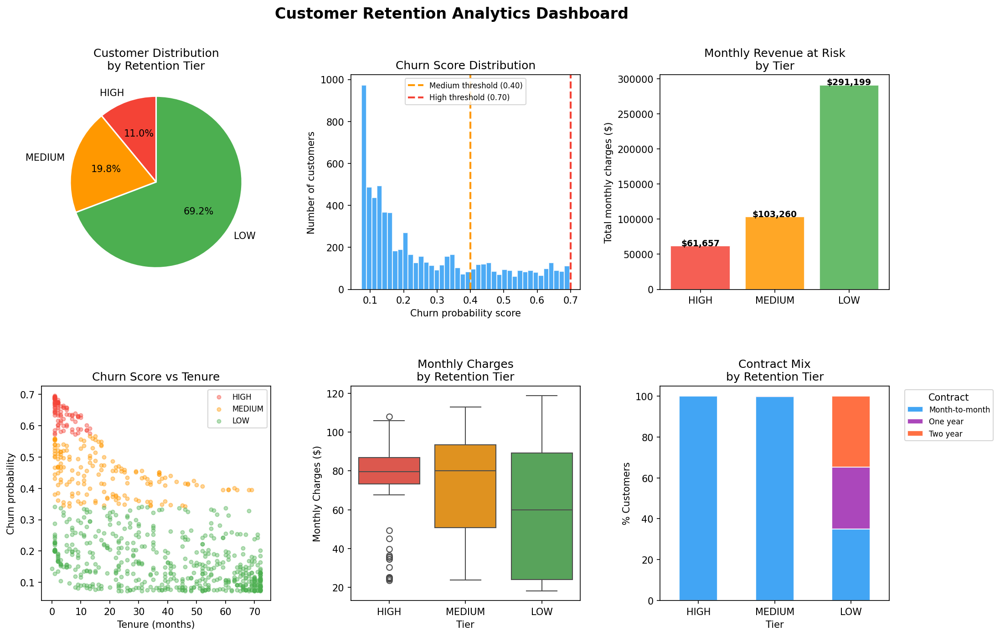
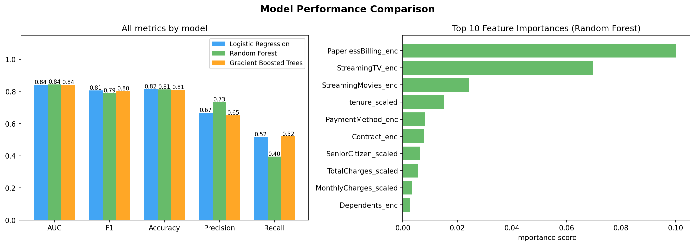
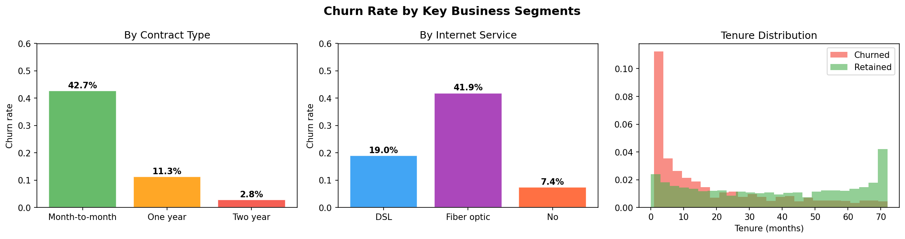
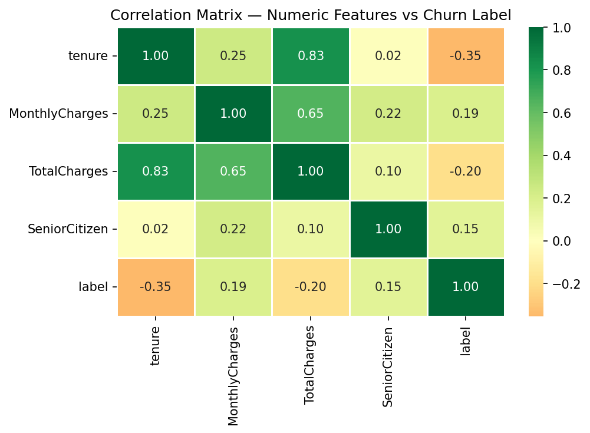

#  Customer Retention Analytics & Churn Prediction

> End-to-end PySpark ML pipeline on Databricks that identifies at-risk customers, generates churn probability scores, and produces prioritised retention tiers — directly mirroring what analytics teams at financial institutions use for proactive retention programmes.

---

## 📊 Project Results

| Model | AUC-ROC | F1 Score | Accuracy | Precision | Recall |
|---|---|---|---|---|---|
| Logistic Regression | 0.843 | 0.807 | 0.816 | 0.669 | 0.518 |
| **Random Forest** | **0.843** | **0.793** | **0.808** | **0.730** | **0.399** |
| Gradient Boosted Trees | 0.843 | 0.803 | 0.813 | 0.652 | 0.518 |

**Best model: Random Forest — AUC-ROC 0.843** (target was > 0.80 ✅)

### Revenue Impact
| Retention Tier | Customers | Monthly Revenue at Risk |
|---|---|---|
| 🔴 HIGH — Immediate outreach | 11% | $61,657 |
| 🟡 MEDIUM — Schedule call | 19.8% | $103,260 |
| 🟢 LOW — Monitor only | 69.2% | $291,199 |

> Annualised HIGH-tier revenue at risk: **~$739,884**
> If retention saves 30% of HIGH-tier customers: **~$221,965 saved annually**

---

## 📈 Project Visualisations

### Retention Dashboard


### Model Performance Comparison


### EDA — Churn by Key Business Segments


### Correlation Matrix


---

## 🔍 Key Business Insights

### From Statistical Analysis (Chi-square + T-test)

**Categorical features significantly linked to churn (p < 0.05):**
- **Contract type** — Month-to-month customers churn at **42.7%** vs only 2.8% for two-year contracts
- **Internet service** — Fiber optic customers churn at **41.9%** — highest of any segment
- **Payment method** — Electronic check users show highest churn risk (~45%)
- **Online security / Tech support** — Customers without these services churn significantly more

**Numerical features significantly different between churned vs retained (t-test, p < 0.05):**
- **Tenure** — Churned customers stay only **~18 months** vs ~38 months for retained
- **Monthly charges** — Churned customers pay **~$13/month more** on average
- **Total charges** — Lower totals = newer customers = higher churn risk

### From Model Feature Importances (Random Forest)
Top predictors of churn:
1. `PaperlessBilling` — strongest single predictor
2. `StreamingTV` — high signal for churn behaviour
3. `StreamingMovies` — correlated with service dissatisfaction
4. `tenure_scaled` — longer tenure = much lower churn risk
5. `PaymentMethod` — electronic check significantly riskier

---

## 🏗️ Architecture

```
Raw CSV (Kaggle Telco)
        │
        ▼
Phase 1 — Data Loading & Cleaning
  • PySpark DataFrame via Unity Catalog Volume
  • Fix TotalCharges nulls (median imputation)
  • Create binary label column (Churn → 0/1)
        │
        ▼
Phase 2 — EDA + Statistical Testing
  • Chi-square test (13 categorical features)
  • Independent t-test (3 numerical features)
  • Matplotlib / Seaborn visualisations
        │
        ▼
Phase 3 — Feature Engineering Pipeline
  • StringIndexer → OneHotEncoder (14 categorical cols)
  • StandardScaler (4 numerical cols)
  • VectorAssembler → single "features" vector
  • Delta checkpoint for train/test split (serverless-safe)
        │
        ▼
Phase 4 — Model Training + Evaluation
  • Logistic Regression (baseline)
  • Random Forest (100 trees, maxDepth=5)
  • Gradient Boosted Trees (50 iterations, lr=0.1)
  • MLflow experiment tracking
  • Threshold tuning (0.5 → 0.4 for higher recall)
        │
        ▼
Phase 5 — Risk Scoring + Priority Tiers
  • Churn probability scores for all customers
  • 3-tier prioritisation (HIGH / MEDIUM / LOW)
  • Revenue at risk quantification
  • Retention action recommendations
  • retention_action_list.csv output
```

---

## 🛠️ Tech Stack

| Category | Technologies |
|---|---|
| **Distributed Computing** | Apache Spark 3.5, PySpark, Databricks Free Edition (Serverless) |
| **ML Framework** | PySpark MLlib — LogisticRegression, RandomForestClassifier, GBTClassifier |
| **Feature Engineering** | StringIndexer, OneHotEncoder, StandardScaler, VectorAssembler, Pipeline |
| **Statistical Testing** | scipy.stats — chi2_contingency, ttest_ind |
| **Experiment Tracking** | MLflow (built-in Databricks) |
| **Data Storage** | Unity Catalog Volumes, Delta Lake |
| **Visualisation** | Matplotlib, Seaborn |
| **Language** | Python 3.x |

---

## 📁 Repository Structure

```
customer-retention-analytics/
│
├── notebooks/                            # All Databricks phase notebooks
│   ├── phase1_load_data.py               # Data loading, cleaning, null fixing
│   ├── phase2_eda_stats.py               # EDA, chi-square tests, t-tests, charts
│   ├── phase3_feature_engineering.py     # ML pipeline, encoding, Delta checkpoint
│   ├── phase4_model_training.py          # Model training, MLflow tracking
│   └── phase5_risk_scoring.py            # Churn scoring, priority tiers, dashboard
│
├── retention_dashboard.png               # Full 6-chart retention analytics dashboard
├── model_comparison.png                  # Model performance + feature importances
├── eda_charts.png                        # Churn by contract, internet, tenure
├── correlation.png                       # Correlation matrix heatmap
│
└── README.md                             # This file
```

> **Note:** `retention_action_list.csv` (680 KB — scored customers) is excluded from the repo. Generate it by running Phase 5.
> **Note:** `train_delta/`, `test_delta/`, `churn_pipeline/`, `churn_rf_model/` are auto-generated at runtime in your Databricks Volume — not committed to GitHub.

---

## 🚀 How to Run

### Prerequisites
- Databricks Free Edition account ([signup.databricks.com](https://signup.databricks.com))
- Kaggle account to download dataset
- No local installation required — runs entirely on serverless compute

### Setup (one time)

**1. Download dataset**
```
Kaggle → search "Telco Customer Churn" (BlastChar dataset)
→ Download WA_Fn-UseC_-Telco-Customer-Churn.csv
→ Rename to telco_churn.csv
```

**2. Create Volume in Databricks**
```python
spark.sql("CREATE VOLUME IF NOT EXISTS main.default.churn_data")
```

**3. Upload dataset**
```
Databricks sidebar → New → Add or upload data
→ Upload files to a volume
→ Select: main > default > churn_data
→ Upload telco_churn.csv
```

### Run phases in order

Open each notebook from the `notebooks/` folder in your Databricks workspace:

```
notebooks/phase1_load_data.py           →  Day 1-2
notebooks/phase2_eda_stats.py           →  Day 3-5
notebooks/phase3_feature_engineering.py →  Day 6-8
notebooks/phase4_model_training.py      →  Day 9-13
notebooks/phase5_risk_scoring.py        →  Day 14-16
```

Each phase builds on the previous. Run all cells top-to-bottom using `Shift+Enter`.

### Session restart reload snippet
```python
# Paste at top if Databricks session restarted between phases
from pyspark.sql import functions as F
from pyspark.sql.types import DoubleType

FILE_PATH = "/Volumes/main/default/churn_data/telco_churn.csv"
df_raw    = spark.read.csv(FILE_PATH, header=True,
                           inferSchema=True, nullValue=" ")
df        = df_raw.withColumn("TotalCharges",
               F.col("TotalCharges").cast(DoubleType()))
median_val = df.approxQuantile("TotalCharges", [0.5], 0.01)[0]
df        = df.fillna({"TotalCharges": median_val})
df        = df.withColumn("label",
               F.when(F.col("Churn") == "Yes", 1).otherwise(0))
df.createOrReplaceTempView("churn_data")

# Reload Delta checkpoints from Phase 3
train_df = spark.read.format("delta").load(
    "/Volumes/main/default/churn_data/train_delta")
test_df  = spark.read.format("delta").load(
    "/Volumes/main/default/churn_data/test_delta")

# Reload models
from pyspark.ml import PipelineModel
from pyspark.ml.classification import RandomForestClassificationModel

pipeline_model = PipelineModel.load(
    "/Volumes/main/default/churn_data/churn_pipeline")
rf_model       = RandomForestClassificationModel.load(
    "/Volumes/main/default/churn_data/churn_rf_model")

print(f"Reloaded: {df.count():,} rows — ready to continue")
```

---

## 📊 Dataset

**Source:** [Telco Customer Churn — IBM Watson Sample Data](https://www.kaggle.com/datasets/blastchar/telco-customer-churn)

| Property | Value |
|---|---|
| Rows | 7,043 customers |
| Features | 21 columns |
| Target | Churn (Yes/No → 1/0) |
| Class imbalance | 73% retained / 27% churned |
| Tenure range | 0–72 months |
| Monthly charges | $18.25–$118.75 |

---

## 💡 Retention Action Framework

| Tier | Churn Score | Action | Customers |
|---|---|---|---|
| 🔴 HIGH | ≥ 0.70 | Personal call within 48 hrs, offer contract upgrade + 15% discount | 11% |
| 🟡 MEDIUM | 0.40–0.70 | Automated personalised email, bundle upgrade offer | 19.8% |
| 🟢 LOW | < 0.40 | Monthly newsletter, loyalty milestone rewards, monthly re-score | 69.2% |

---

## 🎯 Skills Demonstrated

- **PySpark** — distributed DataFrame operations, Spark SQL, MLlib pipeline
- **Statistical modelling** — hypothesis testing, chi-square, t-test, feature selection by p-value
- **Machine learning** — classification, model comparison, threshold tuning, AUC-ROC evaluation
- **MLflow** — experiment tracking, metric logging, model registry
- **Delta Lake** — serverless-safe data checkpointing
- **Feature engineering** — encoding, scaling, pipeline design, data leakage prevention
- **Business analytics** — revenue at risk quantification, customer segmentation, retention tier design
- **Data visualisation** — Matplotlib, Seaborn, 6-panel dashboard

---

## 👤 Author

**Nikhil Kumar**
B.Tech Computer Science — Chandigarh University (2022–2026)

[](https://github.com/nikhil-2818)
[](https://www.linkedin.com/in/nikhil-kumar-007n)
---

*Built on Databricks Free Edition · Apache Spark 3.5 · MLflow · Delta Lake*
